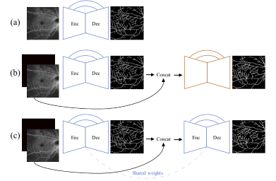

# BOE2020 OCTA vessel segmentation
This repository contains a Python3 Tensorflow implementation of the methods described in
 'Deep iteratitive vessel segmentation in OCT angiography'.

## Dependencies
   - [Tensorflow 1.9.0][tf] (the code should be compatible with any 1.x version of tensorflow).
   - [Numpy][np]
   - [Scipy][scpy] 
   - [Opencv3][cv2] (us ed only for storing and reading images)
   - [matplotlib][plt] (used only for segmentation visualization)
   - [vgg19 pretrained weights][vgg19] (required only for computing a perceptual loss, must be downloaded and extracted)
   
## Contents
* Pretrained model weights and code to perform vessel segmentation on OCTA images. 
* Demonstration of results on unseen publicly available OCT-A images including montages of multiple images and images captured with different commercial scanners.
* Demonstration of the iterative refinement effect achieved by iUNET on unseen images (please see 'segmentation_iunet' directory)
* Code for defining all models and loss functions and training as described in the paper.

## Usages-examples
* A commented example of how to use the pretrained models is provided in 'example_use_pretrained.py' : specifically given a directory of OCT-A images,
 it loads a pretrained model to segment them and saves the results. 
* An example of how to define and train the models is provided in 'example_use_train.py'.
* Loss functions and network definitions can be found in 'losses.py' and 'networks.py' respectively. 
The 3 architectures that are implemented are (a) UNET, (b) Stacked Hourglass Network and (c) iterative UNET or iUNET.



[tf]: https://www.tensorflow.org/install/pip
[np]: https://numpy.org/
[scpy]: https://www.scipy.org/
[cv2]: https://opencv.org/
[plt]: https://matplotlib.org/
[link_to_paper]: https://www.osapublishing.org/boe/viewmedia.cfm?uri=boe-11-5-2490&seq=0
[vgg19]: http://download.tensorflow.org/models/vgg_19_2016_08_28.tar.gz

## Citation
If you use this code in your work, please kindly cite [Pissas et al. (2020)][link_to_paper]:
* Pissas et al., [Deep iterative vessel segmentation in OCT angiography][link_to_paper], Biomedical Optics Express Vol. 11, Issue 5, pp. 2490-2510 (2020)  DOI: https://doi.org/10.1364/BOE.384919.

BibTeX entry:

```
@article{Pissas:20,
  author = {Theodoros Pissas and Edward Bloch and M. Jorge Cardoso and Blanca Flores and Odysseas Georgiadis and Sepehr Jalali and Claudio Ravasio and Danail Stoyanov and Lyndon Da Cruz and Christos Bergeles},
  title = {Deep iterative vessel segmentation in OCT angiography},
  journal = {Biomed. Opt. Express},
  keywords = {Feature extraction; Imaging systems; Medical image processing; Neural networks; Optical coherence tomography; Retina scanning},
  year = {2020},
  number = {5},
  pages = {2490--2510},
  publisher = {OSA},
  volume = {11},
  month = {May},
  url = {http://www.osapublishing.org/boe/abstract.cfm?URI=boe-11-5-2490},
  doi = {10.1364/BOE.384919},
}
```

## Licensing and copyright 

Please see the LICENSE file for details.

## Acknowledgements
[nihr]: http://www.nihr.ac.uk/
[erc]: https://erc.europa.eu/
This work was supported through an Invention for Innovation grant [II-LB-0716-20002] by the [National Institute for Health Research][nihr],
through a grant [714562] by the [European Research Council][erc] and by Sir Michael Uren Foundation.

